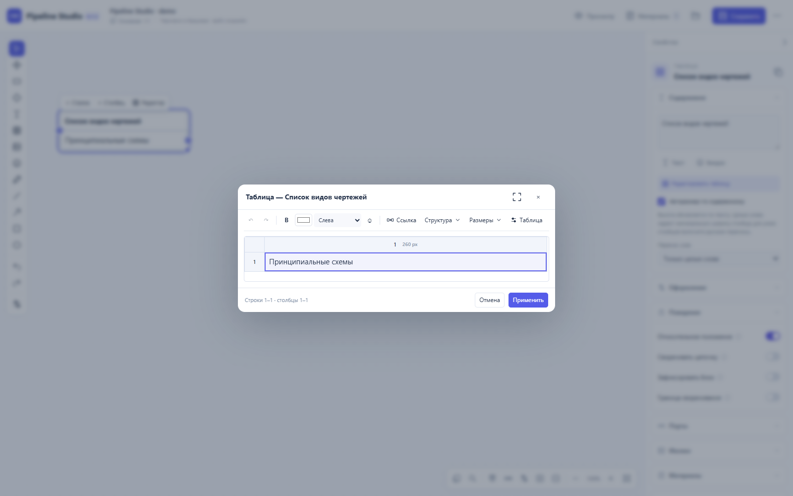

# Pipeline Studio

Редактор схем процессов с таблицами, условиями, связями и источниками. Интерфейс на русском языке. Windows-приложение открывает оригиналы файлов и сохраняет полный путь; готовый HTML можно просматривать в браузере.

**[Выпуск 0.7.17](https://github.com/wladsergeew013-glitch/Pipeline-Studio/releases/tag/v0.7.17)** · Windows EXE, автономный HTML и ZIP с исходниками.

ПД сохраняет центр при уплотнении ветвей, а статусы остаются над блоками при панорамировании. Общий пайплайн ВК/ОВ сохраняет внутреннюю раскладку при раскрытии соседей; парные связи выбирают одинаковые изгибы и ограничивают движение у препятствий. Добавлен ползунок расстояния между пайплайнами 24–600 px. Исправлено открытие HTML после переноса EXE. [Симметрия и проверки](docs/SHARED-SYMMETRY-2026-10-07.md). [Центрирование и статусы](docs/VIEW-ANCHORS-2026-10-06.md). [Стенд проверки раскладки](docs/LAYOUT-LAB.md). [Перенос приложения](docs/PORTABLE-TRANSFER-2026-10-05.md).

Запустите `Pipeline-Studio-0.7.17-x64.exe`, создайте документ или выберите «Открыть HTML». Python, Node.js и локальный сервер для запуска EXE не нужны. Пример находится в `documents/Demo.html`. Автономный `Pipeline-Studio.html` также можно открыть в Chrome или Edge. Прямое открытие готового HTML запускает просмотрщик; для редактирования откройте его через Studio.

Версия: **0.7.17**. [Проводник из HTML и старые примечания](docs/HTML-EXPLORER-NOTES-2026-10-04.md). [Windows EXE](docs/DESKTOP-2026-10-04.md). [Пути и открытие оригиналов](docs/MATERIALS-ORIGINALS-2026-10-03.md). [Добавление источников](docs/SOURCE-EDITOR-2026-10-03.md). [Статусы таблиц](docs/TABLE-STATUS-2026-10-03.md). [Единый масштаб блоков, эмодзи и капсул](docs/DIAGRAM-SCALE-2026-10-03.md). Предыдущие итерации: [обратимые режимы и общие цепочки](docs/ADAPTIVE-VIEWS-2026-10-03.md), [исправления редактора](docs/WORKFLOWS-2026-10-03.md), [раздельные капсулы статусов](docs/STATUS-CAPSULES-2026-10-03.md).

EXE читает полные пути Windows и открывает оригиналы в Word, Excel и PowerPoint без скачивания. Итоговый HTML сохраняет полный и относительный адрес материала; Office может открываться через ссылку приложения без работающего локального хоста. Просмотр картинок, видео и PDF работает по исходным адресам. При первом запуске EXE регистрируется только собственный протокол, обычные HTML-файлы остаются в браузере.

В «Материалах документа» закреплены поиск, «Добавить источник» и «Проверить доступность». Сначала выберите файл или ссылку. Для файла название, тип и путь заполняются автоматически; для ссылки введите адрес и название. Проверка показывает потерянные файлы в списке. «Заменить» выбирает новый оригинал с сохранением привязок. Закрытие правки возвращает список; щелчок вне него не закрывает окно. Тестовые PDF, Word, Excel, презентация, видео и картинка находятся в `documents/`.

Активные статусы собраны в капсулу слева над блоком; нажатие открывает их подписи и настройки. Справа находится отдельная кнопка сворачивания со счётчиком скрытых блоков. Капсулы всех блоков всегда привязаны сверху и не переходят вниз при панорамировании; за краем холста они скрываются. Контролы имеют постоянные размеры в координатах схемы и масштабируются вместе с блоком; в просмотрщике доступны подписи статусов без редактирования.

Эмодзи внутри текста блоков и ячеек масштабируются вместе с текстом. При отдалении вся схема, включая капсулы статусов и кнопки сворачивания, уменьшается пропорционально. Авторские размеры и переносы строк сохраняются; печать использует обычные размеры содержимого. Комментарий отличается формой с загнутым углом. Браузерное выделение текста и перетаскивание картинок отключены на холсте и в панелях; текстовые поля и редакторы ячеек сохраняют обычное выделение для правки.

«Сохранить» (Ctrl+S) записывает HTML по открытому файловому дескриптору. При открытии через перетаскивание или обычный файловый input браузер может не сохранить право записи: первое сохранение предложит исходное имя, выберите этот файл один раз. «Сохранить как» и выгрузки в меню «Документ» создают отдельный файл. На старте доступны создание документа, открытие HTML / JSON и недавние файлы. Карточка показывает известный путь без обрезания; если браузер не передал расположение, сообщает об этом. Команда открытия папки проекта удалена. Папка материалов подключается отдельно и не подменяет расположение документа.

Для ячейки справа доступны её собственные цвета и оформление. Кнопка «Свойства всей таблицы» возвращает общий контекст. Шесть готовых тем применяются к текущему объекту, нескольким выбранным объектам одной категории или диапазону в редакторе таблицы. Инструмент «Копировать свойства» слева переносит заливку, оформление или совместимые поведения; Esc завершает перенос.

## Таблицы

- Двойной щелчок по ячейке — ввод текста прямо на холсте. Ctrl+Enter применяет правку, Esc отменяет.
- У выбранной таблицы можно тянуть границы строк и столбцов. Кнопки над ней добавляют строку или столбец.
- «Редактор» открывает продвинутые действия: диапазоны, объединения, форматирование, ссылки. Маленькая таблица открывается в компактном окне. Кнопка в заголовке включает полный экран.
- В меню «Таблица» находятся авторазмер и переносы. Длинные слова сохраняются целиком либо переносятся с дефисом по встроенному русскому словарю.
- Ссылку можно вставить в текст или прикрепить к ячейке. Прикрепление показывает значок, название файла или свою подпись. Кнопка открытия показывает расположение, копирование адреса и открытие источника.



## Схемы и связи

Авторазмер блока и условия увеличивает обе стороны с сохранением пропорций. Закрепление относительного положения включено по умолчанию: перемещение родителя переносит последующие блоки. Дочерний блок можно двигать отдельно; фиксированные потомки остаются на месте. Поведение можно отключить в свойствах.

Shift/Ctrl добавляет связи и гребёнки к выделению. Щелчок по линии выбирает связь целиком, а по ответвлению гребёнки — всю гребёнку. Alt + щелчок позволяет выбрать отдельную связь в гребёнке и переключаться между совпавшими трассами. В инспекторе отдельной связи показаны её привязки симметрии, переход к общей гребёнке и выключатель поведения. Новая связь создаётся отдельно; объединение в гребёнку выполняется явной командой.

Квадратный маркер на трассе выбирает участок. Delete убирает его локальный изгиб; при выборе линии целиком удаляет связь. Необходимый для подключения изгиб удалить нельзя. Ctrl+Z отменяет изменение. Двойной щелчок по сегменту открывает подпись прямо на холсте: Enter применяет текст, Esc отменяет. Выбранную подпись можно перетащить без изменения трассы.

В разделе «Симметрия» подключённые порты выравниваются с учётом продолжения каждой ветви. «Разрешить пересечение ветвей» переключает расчёт на размеры конечных блоков. Симметрия общей гребёнки и симметрия всех выбранных её связей используют одну настройку. «Выровнять сейчас» — разовая команда; «Сохранять симметрию» поддерживает результат при перемещении. Свободная гребёнка поддерживает несколько источников и несколько приёмников. Её объединённые начала по умолчанию переносят и сворачивают общую цепочку вместе; это можно отключить в свойствах гребёнки. Тип «Провод» применяется ко всей гребёнке.

Подпись по умолчанию центрируется вдоль сегмента. В свойствах связи можно выбрать сегмент или отключить центрирование. При перетаскивании блока близкие соединённые порты выравниваются в прямую линию; Alt временно отключает привязки. Для точного выравнивания есть команда «Выровнять по портам» в свойствах связи. Поле «Тип блока» превращает обычный блок или старое примечание в условие или комментарий, сохраняя ID, текст, оформление и соединения. Таблица сохраняет отдельный тип.

Связь хранит родителя отдельно от направления стрелки: в «Родство блоков» выберите источник, приёмник или отсутствие родства. Комментарий по умолчанию дочерний для подключённого блока, даже если стрелка направлена к родителю. «Убирать свободные промежутки» и «Раздвигать цепочки» вычисляют отдельный вид поверх сохранённых координат. Выключение режимов возвращает исходный вид с учётом сделанных вручную правок. Перенос одного блока не записывает в документ автоматические смещения соседних цепочек.

Раздвижение использует весь прямоугольник продолжения: верхнюю, нижнюю и боковые границы, включая пустые промежутки между его блоками. Продолжения с общими этапами образуют одну цепочку; общий входящий узел остаётся за её пределами. Фиксированные ветви учитываются как препятствия. Сворачивание и повторное раскрытие пересчитывают вид из исходной раскладки.

«Защитить от правки» запрещает случайный перенос, изменение текста и удаление элемента. Снимите защиту в свойствах. Защищённый потомок следует за родителем и участвует в автоматическом раздвижении. Только фиксация положения удерживает его координаты. Это отдельная настройка от фиксации положения и размера.

Инструмент рамки (M) выделяет блоки, связи, гребёнки и рисунки. Слева направо выбирает целиком попавшие элементы, справа налево — пересекаемые. Shift / Ctrl добавляет к выделению. Объекты одной категории показывают общие текст, оформление, пресеты и поведение; различающиеся значения отмечены «Разное». Смешанное выделение показывает общие свойства. Выбор категории открывает её дополнительные настройки, включая фиксацию всех выбранных блоков. Защищённые элементы пропускаются при правке; снять защиту можно массово. Одна массовая правка отменяется одной командой Ctrl+Z.

Параметры рисования появляются справа при выборе карандаша, линии или фигуры. У выбранного рисунка там отображаются его свойства.

## Внутренние ссылки и продолжения строк

В реестре выберите «Новый источник» → «Внутренняя ссылка», затем лист и блок либо весь лист. В редакторе ячейки: «Ссылка» → «В текст» или «К ячейке» → «Внутри схемы». Переход раскрывает скрытый блок, выделяет его и центрирует экран. Связи сохраняются по ID при переименовании и перемещении цели.

В свойствах таблицы откройте «Продолжение строк» и включите кнопку нужной строки. Она сворачивает следующие блоки этой строки, сохраняя общие этапы других открытых ветвей. Читатель может включать и убирать кнопки для себя; эти предпочтения хранятся в его браузере.

## Сохранение

Ctrl+S сохраняет HTML документа. Браузерный черновик не заменяет файл на диске. Внешние PDF, Word, видео и другие материалы остаются в своих папках: подключите папку проекта или используйте доступные HTTP(S)-адреса. При передаче документа с относительными путями передавайте папку материалов вместе с ним.

Рабочие документы хранятся отдельно от программы. В комплект исходников включён только искусственный демонстрационный пример.

## Разработка

Исходники интерфейса — `app/static/`, модель и геометрия — `core.js`. Сборка автономного HTML:

```sh
python build_portable.py
python tests/run_checks.py
```

Нужны Python 3.10+ и Node.js. Для браузерных проверок дополнительно:

```sh
npm install --no-save --package-lock=false playwright
npx playwright install chromium
python tests/run_checks.py --browser
```

Можно задать переменную `STUDIO_CHROMIUM` с путём к Chromium. Локально пройдена 661 проверка, включая 27 файлового моста и 23 packaged EXE. Дополнительный набор материалов запускается с `--materials`; нужны python-docx, python-pptx, reportlab и Pillow. Проверка преобразования офисного файла дополнительно требует LibreOffice; без него она пропускается. Для EXE добавьте `--desktop` после сборки приложения. Текущий отчёт: [0.7.16](docs/HTML-EXPLORER-NOTES-2026-10-04.md).

## Необязательный сервер

```sh
python app/server.py --open
```

По умолчанию сервер слушает только `127.0.0.1:8765`. Для локальной сети задайте `STUDIO_PASSWORD`, при необходимости `STUDIO_READER_PASSWORD`, и `--host`. Для размещения за пределами компьютера нужен аутентифицированный HTTPS reverse proxy. Docker Compose использует переменные из `.env`; этот файл исключён из Git.

Полный обход всех посторонних блоков маршрутизатором не гарантируется. Русские переносы рассчитаны по словарю, а не по смыслу текста. Настоящая доступность внешних файлов и URL зависит от среды пользователя.

Сведения о сторонних ресурсах и лицензиях: [THIRD_PARTY_NOTICES.md](THIRD_PARTY_NOTICES.md), [licenses/README.md](licenses/README.md).
