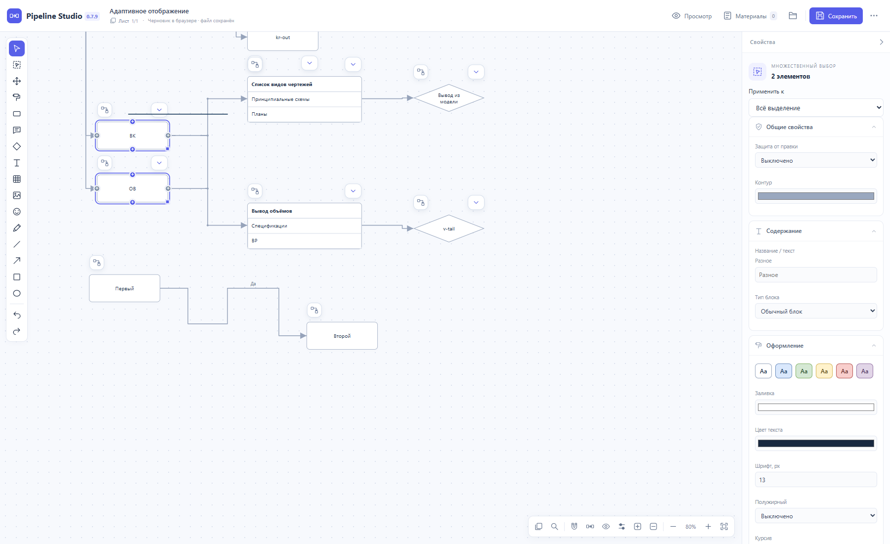

# Pipeline Studio 0.7.9 — обратимые режимы и управление связями

Исторический отчёт итерации 0.7.9. Скорость переноса и область действия симметрии исправлены в [0.7.10](ZOOM-AND-DRAG-2026-10-03.md); единый масштаб блоков, эмодзи и капсул — в [0.7.11](DIAGRAM-SCALE-2026-10-03.md).

Локальная сборка исправляет поведение на эталонной схеме и расширяет инспектор, симметрию и быстрые действия. Раздельные капсулы сохранены. Исходный пользовательский HTML остаётся неизменным.



Снимок сделан в программе на искусственном примере. [Полная панель свойств нескольких блоков](images/adaptive-views/bulk-properties.png).

## Раскладка и адаптивный вид

Документ хранит авторские координаты. «Раздвигать цепочки» и «Убирать свободные промежутки» строят вид поверх них. Сворачивание, раскрытие и переключение режимов пересчитывают результат из исходной раскладки. После выключения режимов возвращается прежний вид с учётом новых ручных правок. Перемещение в адаптивном виде записывает только перемещение выбранной ветви, её продолжения и связанных симметричных ветвей.

Раздвижение учитывает полный прямоугольник каждой цепочки, включая свободную область между верхним и нижним потомком. Цепочки с общими этапами объединяются; общий входящий узел не становится частью каждой из них. Поэтому длинная ветвь КР вытесняет общую ветвь ВК/ОВ целиком, сохраняя её внутренние расстояния. Фиксированная ветвь учитывается как неподвижное препятствие. Отключённые режимы сохраняют ручную раскладку, в том числе её возможные пересечения.

Капсулы статусов, сворачивания и кнопки продолжения строк имеют фиксированный размер на экране при масштабе 25–200%. Они следуют за краями своего блока. На обзорном масштабе сохраняется появление контролов при наведении и выделении; на сенсорном экране зоны нажатия увеличиваются до 44 px.

## Общие цепочки и симметрия

- У симметричной свободной гребёнки с несколькими началами включено «Переносить объединённые начала вместе». Перенос ВК или ОВ перемещает оба начала и всё общее продолжение один раз; сворачивание любого начала скрывает ту же общую цепочку. Настройка выключается в свойствах гребёнки. Защищённый потомок следует за родителем; фиксированный сохраняет координаты.
- Гребёнка с несколькими источниками и приёмниками поддерживает выравнивание обеих сторон. Список чертежей и вывод объёмов центрируются относительно общих начал, а собственные продолжения следуют за своей ветвью.
- Симметрия учитывает габариты всего продолжения. «Разрешить пересечение ветвей» переключает расчёт на конечные блоки и позволяет более плотное размещение. Автоматическое раздвижение независимых цепочек сохраняет свои правила.
- «Выровнять сейчас» выполняет разовую команду. «Сохранять симметрию» поддерживает расположение при движении. Для всей гребёнки используется одна настройка; прежние дублирующие наборы связей мигрируют без изменения исходных координат.
- У отдельной связи инспектор показывает общую гребёнку и наборы симметрии, их состояние, переход к настройке и выключатель. Отключение сохраняет текущую геометрию этой симметрии, не записывая адаптивные смещения других цепочек. Защита блокирует ручное изменение привязки; просмотрщик показывает значения без полей правки.

## Выделение и быстрые действия

- Однородный множественный выбор показывает текст, оформление, готовые темы и совместимые свойства поведения. Различающиеся значения отмечаются «Разное». Назначение свойства не меняет остальные свойства и создаёт один шаг отмены.
- Смешанный выбор показывает общие свойства. Выбор категории открывает её параметры, сохраняя выделение остальных объектов. «Все блоки» позволяет массово закрепить выбранные обычные блоки, условия и таблицы. Защита доступна сразу всему смешанному выделению.
- Щелчок по линии выбирает связь целиком. У гребёнки обычный щелчок выбирает всю гребёнку; Alt + щелчок выбирает отдельную связь и переключается между совпавшими трассами. Квадратный маркер явно выбирает участок. Delete удаляет всю выбранную связь либо локальный изгиб выбранного участка. Ctrl+Z отменяет действие.
- Двойной щелчок на сегменте открывает ввод подписи на холсте. Enter применяет текст, Esc отменяет, уход из поля применяет правку. Выбранная подпись переносится независимо от трассы; смещение сохраняется при повторном открытии.
- Поле «Тип блока» преобразует обычный блок, условие и комментарий, сохраняя ID, оформление, положение и соединения. Таблица остаётся отдельным типом.
- Тип линии «Провод» применяется к гребёнке. Создание дополнительной связи сохраняет её самостоятельной; гребёнка создаётся только явным объединением.

## Проверки

Полный локальный прогон 3 октября 2026 в Edge 154: **463 проверки прошли, одна пропущена**.

| Набор | Прошло |
|---|---:|
| Публичная модель | 163 |
| Дополнительная модель частного эталона | 8 |
| Публичные браузерные сценарии | 249 |
| Дополнительные браузерные сценарии частного эталона | 7 |
| HTTP | 25 |
| Материалы | 11 |

В новых наборах — 20 проверок модели и 48 браузерных сценариев, включая шесть новых сценариев частного эталона. Проверены живое перетаскивание мышью, исходные позиции после циклов сворачивания, полный перенос ВК/ОВ с обоих начал, выравнивание сторон гребёнки, миграция повторных привязок, режим разрешённых пересечений, множественные свойства и отмена, преобразование типов, реальные двойные щелчки, перенос подписи, удаление участка и целой линии, защита, просмотрщик, четыре масштаба. Ошибок JavaScript в сценариях не обнаружено.

Эталон: редакция 546, два листа; на основном листе — 89 блоков, 89 связей и 7 гребёнок, на втором — 38 блоков. Многократное «свернуть → уплотнить → раскрыть» оставило исходные координаты всех 89 блоков основного листа неизменными. Выключение режимов восстановило исходное представление. Отдельная копия HTML с новым просмотрщиком сохраняет исходный JSON целиком, включая позиции всех 127 блоков. Проверки используют частную копию в исключённой из Git папке `qa`; документ и пользовательские снимки не входят в публичный комплект.

```sh
python tests/run_checks.py --browser --materials
```

Без частного эталона выполняются 448 публичных проверок. Для браузерного запуска можно задать `STUDIO_CHROMIUM`. Необязательная конвертация офисного файла в PDF пропущена, потому что LibreOffice не установлен. Проверки материалов подтверждают сохранность исходников, прикрепление PDF-превью и просмотр видео; открытие в установленном Word или PowerPoint ими не подтверждено.

Публичный релиз 0.7.9 не создавался. Изменения находятся в локальной рабочей ветке `codex/workflows-and-status-design`.
