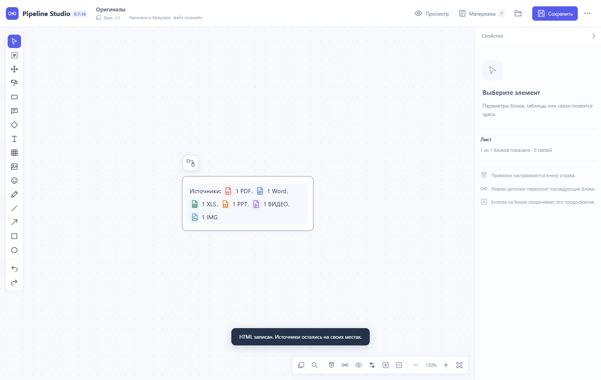
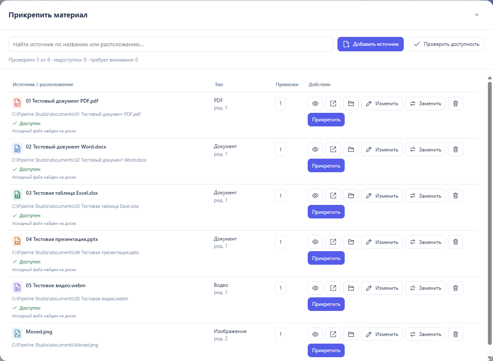

# Pipeline Studio Desktop — 0.7.15

Запустите `Pipeline Studio.exe`. Это самостоятельное portable-приложение Windows x64 с отдельным окном редактора. Установка Python, Node.js и запуск локального HTTP-хоста для работы не требуются. Редактор загружен из комплекта приложения; операции с файлами проходят через нативный IPC Electron.

«Открыть HTML» выбирает настоящий файл Windows и открывает его для редактирования. HTML также можно передать приложению аргументом запуска или перетащить на EXE в Проводнике. Импорт читает JSON схемы как данные и не выполняет код выбранного HTML. «Сохранить» записывает исходный HTML, «Сохранить как» предлагает текущую папку документа и создаёт выбранный файл. Если исходник изменён другой программой, запись останавливается с сообщением о конфликте.

«Добавить источник» → «Выбрать файл» автоматически сохраняет полный путь, имя, тип и размер оригинала. Для файлов возле HTML сохраняется относительный адрес. Картинки, PDF и видео просматриваются непосредственно по файловому адресу внутри приложения. Word, Excel и PowerPoint открываются в установленной системной программе; «Показать в Проводнике» выделяет оригинал. Материалы не копируются в приложение и не встраиваются в HTML.

Экспорт остаётся обычным HTML. Для Office он содержит подписанную ссылку `pipelinestudio://open`. При первом обычном запуске EXE регистрирует этот протокол только для текущего пользователя. Браузер может запросить подтверждение открытия приложения. Studio может запуститься по ссылке, открыть оригинал и завершиться; держать редактор или сервер запущенным не требуется. Обычные `.html`-файлы не переназначаются с браузера на Studio.

На другом компьютере нужно запустить EXE и выбрать доступные там оригиналы. Подписанные адреса принадлежат профилю автора. Старые материалы с одним именем файла требуют одного выбора через «Заменить»; ID и привязки сохраняются. Старый режим `Studio-local.cmd` оставлен для совместимости прежних HTML, но новое приложение его не использует.

Профиль, черновики и доступ к выбранным файлам хранятся в `%APPDATA%\Pipeline Studio`. Перемещение материала обнаруживается свежей проверкой на диске, включая файл, который уже просматривали. Поиск и команды материалов закреплены; закрытие правки возвращает список. Перед закрытием приложения с изменениями можно сохранить HTML, закрыть без сохранения или остаться в редакторе.





Проверки на Windows:

- 620 прежних и файловых проверок прошли; 25 из них проверяют новый файловый мост: исходные байты, настоящие пути, перемещение, ограничения выбранных файлов, переход через junction, подписи, перезапуск, конфликт и последовательность одновременных сохранений. Одна необязательная проверка LibreOffice пропущена.
- 21 сценарий настоящего packaged EXE проходит через окно приложения: открытие HTML, шесть типов источников, PDF, декодирование видео и картинки, проверка после перемещения, замена, реестр, сохранение и «Сохранить как», второй запуск EXE с подписанной ссылкой, внешние сайты в системном браузере. HTTP-запросов к локальному хосту и ошибок JavaScript нет. Диалоги выбора и системный запуск Office в автоматическом наборе заменены тестовыми адаптерами.
- Дополнительная проверка portable EXE и актуальной частной схемы подтверждает запуск из одной поставленной EXE и сохранение координат всех 127 блоков. Проверены повторный запуск по подписанной ссылке и открытие оригинала при закрытом редакторе; настоящий путь DOCX подтверждён через Word COM. У приложения нет TCP-слушателя; прежний хост остановлен. Каждый запуск оболочки распаковывает runtime в отдельную временную папку. Подлинный рабочий HTML не включается в приложение, исходный файл в Downloads не меняется.

Сборка зафиксирована: Electron 44.5.1 и electron-builder 26.15.3, зависимости — в `desktop/package-lock.json`. Portable EXE не имеет цифровой подписи. Проверки этого отчёта относятся к 0.7.15. Текущий выпуск: [0.7.16](HTML-EXPLORER-NOTES-2026-10-04.md).

Для сборки исходников:

```powershell
python build_portable.py
python desktop/prepare.py
cd desktop
npm ci
npm run build
```

Для проверки собранного EXE: `python tests/run_checks.py --browser --materials --desktop`. Путь к распакованному EXE можно задать переменной `STUDIO_DESKTOP_EXE`.

Архитектура использует [изолированный preload](https://www.electronjs.org/docs/latest/tutorial/context-isolation), [IPC](https://www.electronjs.org/docs/latest/tutorial/ipc), [системные диалоги](https://www.electronjs.org/docs/latest/api/dialog), [открытие оригиналов](https://www.electronjs.org/docs/latest/api/shell) и [ссылки приложения](https://www.electronjs.org/docs/latest/tutorial/launch-app-from-url-in-another-app). Страница схемы не получает Node.js; команды принимаются только от основного редактора.
