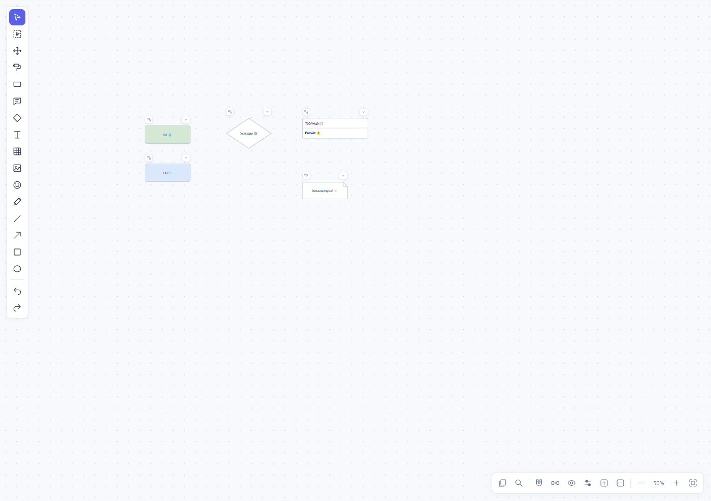

# Pipeline Studio 0.7.11 — общий масштаб схемы

Уточнённое требование: размер значка постоянен **в координатах схемы**. При отдалении эмодзи, капсула статусов и кнопка сворачивания уменьшаются вместе с блоком; при приближении все увеличиваются в одной пропорции.

В 0.7.8–0.7.10 размер капсул компенсировался обратным масштабом. В 0.7.10 такое же поведение ошибочно распространилось на эмодзи внутри текста. Проверки подтверждали постоянный размер на экране, который расходился с требованием пользователя. Поэтому успешный прогон не исключал очевидную проблему на общем виде большой схемы.

## Изменение

- Убрана компенсация зума у капсул статусов, сворачивания блоков и строк, инструментов таблицы. Все размеры и отступы заданы в единицах схемы.
- Эмодзи снова находятся непосредственно в текстовом потоке. Экранные дубликаты и скрытие исходных изображений удалены.
- Разнесение капсул у узкого блока определяется шириной самого блока и не меняется при зуме. Автоматическое скрытие капсул на обзорном масштабе убрано.
- Принятый вид «Раздельные капсулы», настройка статусов, сворачивание, комментарий с загнутым углом, симметрия выбранной пары и ускоренный перенос сохранены.

## Вид в программе

Снимки синтетического документа получены реальными событиями колёсика:

[Общий вид, 10%](images/diagram-scale/overview.png) · [50%](images/diagram-scale/far.png) · [300%](images/diagram-scale/near.png).



## Проверки

Проверяется общий коэффициент масштаба, а не постоянный размер на экране. Например, капсула высотой 30 единиц схемы занимает 3 пикселя при 10%, 15 при 50% и 90 при 300%.

- Колёсико на 2,5 / 10 / 25 / 50 / 100 / 200 / 300 / 400%: пропорции всех эмодзи, капсул статусов и сворачивания совпадают с масштабом блока.
- Таблица: кнопки строк, статусы и сворачивание имеют такой же масштаб; капсулы не перекрываются у узких блоков.
- Открыта текущая частная схема редакции 625 обычным способом в просмотрщике. Проверены исходное вписывание, команда «Вписать», шесть масштабов колёсиком, отсутствие дубликатов эмодзи и ошибок JavaScript.
- Проверено точное совпадение встроенного JSON и всех 127 координат на двух листах. Просмотр и зум не изменили документ. Снимки частного документа осмотрены отдельно и не включены в публичный комплект.

Полный локальный прогон: **504 проверки прошли**, одна необязательная конвертация через LibreOffice пропущена, поскольку программа не установлена. В том числе 169 публичных проверок модели, 282 публичные браузерные, 25 HTTP, 11 материалов и 17 сценариев частного эталона. Проверка обычного открытия последней схемы и её снимков выполнена дополнительно. Команда:

```sh
python tests/run_checks.py --browser --materials
```

Публичный релиз 0.7.11 не создавался.
