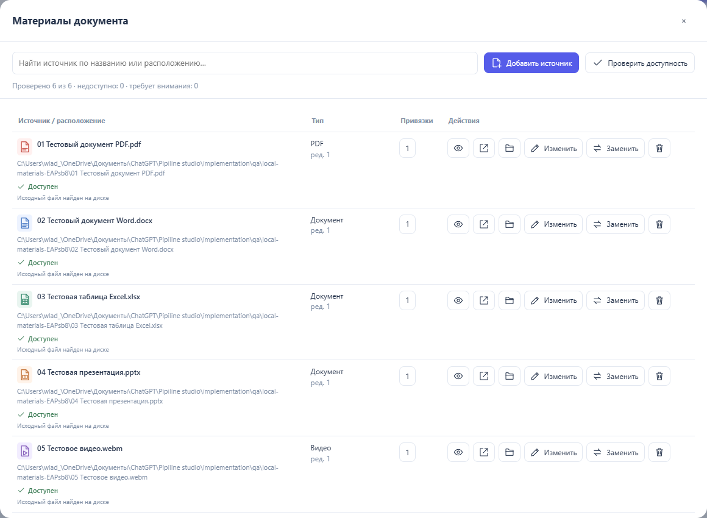
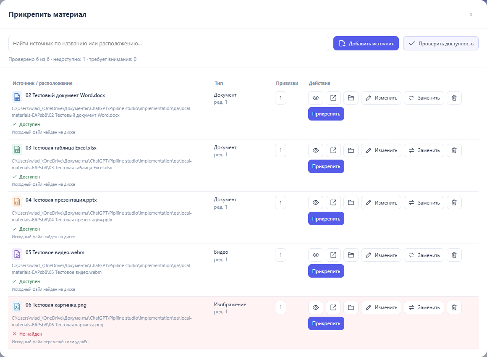

# Источники и оригиналы — 0.7.14

Для работы с полными путями Windows запустите `Studio-local.cmd` из папки программы. Откроется та же Studio по адресу `http://127.0.0.1:8766`. Нужен Python 3.10+; дополнительных пакетов, загрузки материалов на сервер и установки расширения не требуется. Обычный автономный HTML продолжает работать.

В локальной Studio кнопка «Открыть HTML» использует системное окно выбора и запоминает настоящий путь документа. «Добавить источник» → «Выбрать файл» сохраняет полный путь оригинала, имя, тип и размер, а для файлов рядом с документом — также относительный путь с подпапками. Файл остаётся на месте. «Сохранить» записывает выбранный HTML; внешнее изменение файла обнаруживается и требует «Сохранить как».

Сохранённый HTML содержит адреса материалов. Картинки, видео и PDF просматриваются по исходным файлам. Word, Excel и PowerPoint в локальной Studio открываются системной программой через Windows, без скачивания копии. В автономном HTML команда Office использует подписанный адрес локального помощника: он должен быть запущен на компьютере автора. Сам браузер не получает системных прав от наличия полного пути в HTML. На другом компьютере абсолютные адреса потребуют замены источников; относительные адреса удобны для передачи общей папки.

Для старых материалов, у которых сохранено только имя, нажмите «Заменить» и выберите оригинал один раз. ID материала и привязки сохраняются. Существующие ссылки и PDF-превью остаются совместимыми. Без локального режима браузерный выбор файла по-прежнему не сообщает абсолютный путь; Studio явно показывает неопределённость и больше не скачивает Office автоматически.

В «Материалах документа» закреплены поиск и две команды с иконками: «Добавить источник» и «Проверить доступность». Проверка запускается сразу и показывает результат под каждым адресом. Отсутствующий файл отмечен красным. Оригинал проверяется заново, даже если уже открывался: перемещение файла не маскируется старой копией в памяти. Запрет проверки внешнего сайта со стороны браузера обозначается как невозможность подтвердить доступность, а не как удалённая ссылка.

Закрытие правки, замены или просмотра возвращает список, поиск и прокрутку. Щелчок вне списка его не закрывает. Список закрывается крестиком или Escape. «Местоположение» показывает настоящий адрес; в локальной Studio «Показать в Проводнике» выделяет оригинальный файл.

Проверено 03.10.2026 на Windows в Edge 154.0.4258.48:

- `python tests/run_checks.py --browser --materials`: 595 проверок прошли — 169 модели, 291 браузерная, 50 HTTP/файловых, 77 материалов и 8 рабочей схемы. Одна необязательная конвертация LibreOffice пропущена.
- 30 новых браузерных сценариев проверяют шесть настоящих тестовых файлов, отсутствие встроенных копий, проверку после перемещения, замену, сохранение адресов в HTML, автономный просмотр картинки, подписанное открытие Office, отсутствие скачиваний, закреплённую командную строку и возврат поиска/прокрутки. Выбор файла и системный запуск в этом автоматическом наборе представлены тестовыми адаптерами.
- 25 проверок локального помощника используют настоящий HTTP и файловую систему: исходные байты и диапазоны видео, отсутствие кеша, перемещение, запись HTML, конфликт записи, сохранение доступа после перезапуска, границы доступа и подписанное открытие по пользовательскому нажатию.
- Дополнительно настоящий Windows-запуск тестовых DOCX, XLSX и PPTX принят системой. В Word и PowerPoint через COM подтверждены точные пути оригиналов из `documents/` реального проекта. Окно системного выбора файлов не автоматизировалось; открытие Excel через COM отдельно не подтверждено.
- Четыре проверки производного рабочего HTML сохраняют весь исходный JSON и координаты. Исходный файл пользователя не изменён. Частные схемы, пути, состояние помощника и отчёты находятся вне публичного комплекта.

Помощник слушает только loopback, проверяет происхождение команд и токен редактора, допускает выбранные материалы и папки документов. Состояние доступа хранится локально в игнорируемой `app/data/local-files.json`. Сессионный токен в экспорт не попадает. Оригиналы материалов не копируются и не встраиваются.

Ограничения браузера: [файловый input](https://developer.mozilla.org/en-US/docs/Web/HTML/Reference/Elements/input/file) скрывает полный путь; [официальные URI Office](https://learn.microsoft.com/en-us/office/client-developer/office-uri-schemes) описывают HTTP/HTTPS. Поэтому локальные Office-файлы открываются через [Windows `os.startfile`](https://docs.python.org/3/library/os.html#os.startfile), а не через ненадёжную подстановку `file:` в Office-протокол.

Версия подготовлена локально. Публикация и изменения GitHub не выполнялись.
