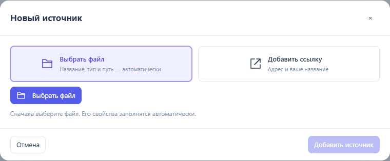
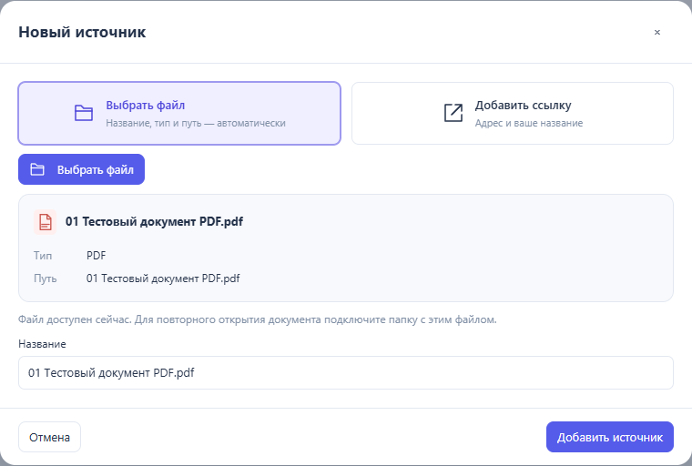
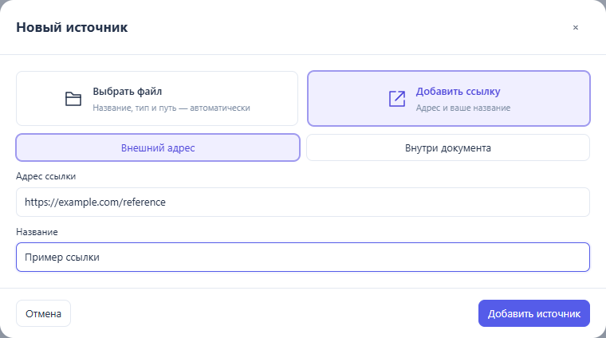

# Pipeline Studio 0.7.13 — добавление источников

«Новый источник» сначала предлагает файл или ссылку. Для файла сначала открывается выбор файла; название, тип и расположение заполняются автоматически. Название можно изменить. Тип и путь показываются как сведения, а не ручные настройки. Для ссылки нужны адрес и название; внутренние ссылки на лист или блок сохранены в этом же варианте.

Убраны выбор типа материала, ручное поле пути, секунды начала видео, PDF-превью и встраивание сайта из этой формы. Новые видео открываются с начала. Переименование существующего источника сохраняет прежние превью и прочие параметры совместимости. Замена файла сохраняет ID материала и существующие привязки.

Файл из подключённой папки получает точный относительный путь, включая подпапки. Нативный выбор использует `DirectoryHandle.resolve`; браузерный input сопоставляет файл с индексом подключённой папки. Если папка не подключена, браузер передаёт имя файла, и источник доступен в текущей сессии; для повторного открытия HTML нужно подключить папку с этим файлом. Файлы не встраиваются в HTML и не копируются программой. Отмена выбора не создаёт материал, добавление и прикрепление к блоку отменяются одним шагом.

Шесть синтетических файлов лежат непосредственно в `documents/`: PDF, DOCX, XLSX, PPTX, WebM и PNG. Это тестовые материалы, не пользовательская схема. Имена и байты совпадают с ранее проверенными файлами.

Проверено локально в Edge 154.0.4258.48 через Playwright:

- `python tests/run_checks.py --browser --materials`: 540 проверок прошли, одна необязательная конвертация через LibreOffice пропущена — LibreOffice не установлен.
- 36 новых проверок формы: реальный файловый input, шесть типов, автоматические свойства, отмена, undo/redo, оригинальные байты офисных файлов, PDF-просмотр, декодирование видео и картинки, внешние и внутренние ссылки, путь в подпапке, HTML и повторное подключение папки. Ветви нативного диалога проверены через дескрипторы и ошибки API; взаимодействие с нативным системным окном не автоматизировалось.
- Четыре дополнительные проверки текущей частной схемы: открытие производного HTML, открытие через настоящую кнопку Studio, новая форма источника, сохранение всех координат и размеров. Исходный JSON целиком совпадает с оригиналом; исходный файл не изменён. Частные данные и снимки хранятся только в игнорируемой `qa/`.
- Word, Excel и PowerPoint открываются как оригинальные файлы через браузерное скачивание; запуск нативных офисных приложений из Studio этой проверкой не подтверждается. Превью существующих материалов сохранены.

Исходники, портативная программа и Demo обновлены локально. Публичный релиз 0.7.13 не создавался.
