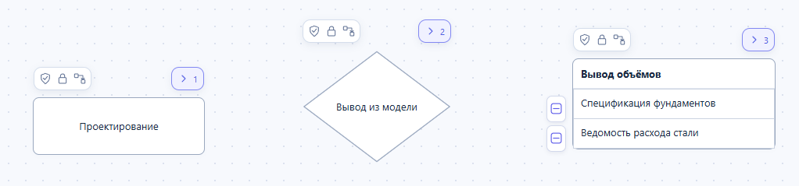
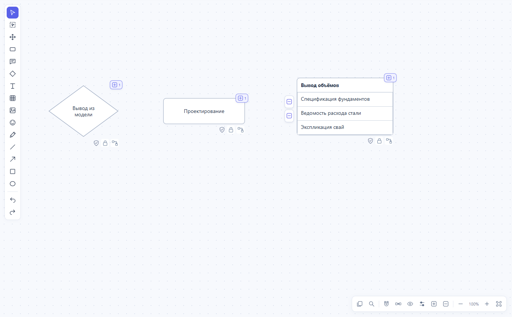
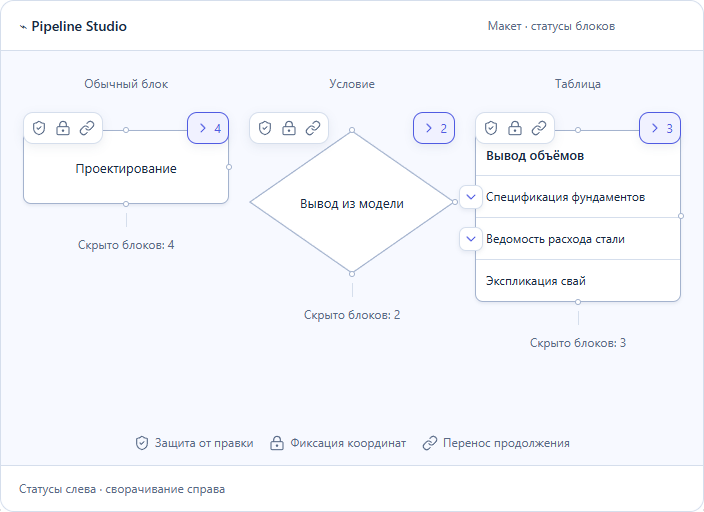
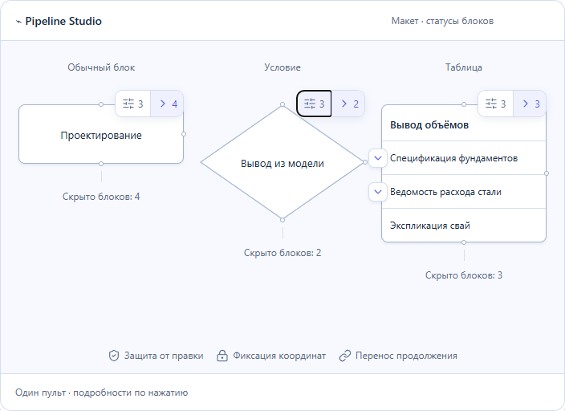

# Статусы и сворачивание Pipeline Studio

После проверки задач версии 0.7.7 подготовлены два варианта. Пользователь выбрал **раздельные капсулы**; этот вариант внедрён в локальную версию 0.7.8. [Отчёт и проверки программы](STATUS-CAPSULES-2026-10-03.md).

## Исходный вид

В исходной версии 0.7.6 все три статуса стояли под блоком; сворачивание цепочки находилось в правом верхнем углу. У таблицы продолжения строк имеют отдельные кнопки слева. В примерах одновременно включены защита, фиксация и относительное положение. Продолжение всей цепочки свёрнуто.

Отдельные снимки: [блок](images/status-before/block.png), [условие](images/status-before/condition.png), [таблица](images/status-before/table.png). Также сохранён [вид с раскрытыми цепочками](images/status-before/expanded-statuses.png).

## Раздельные капсулы — основной вариант

Слева над верхней границей — короткая полоса активных статусов. Справа — самостоятельная кнопка сворачивания со счётчиком скрытых блоков. Текст и порты остаются свободными. У ромба используется тот же внешний прямоугольник управления, поэтому значки не накладываются на его подпись.

Нажатие на статус открывает подписи и настройки. Щит означает запрет ручной правки, замок — удержание координат, цепочка — перенос продолжения вместе с этим блоком. Эти настройки независимы. Число возле стрелки сворачивания относится к скрытому продолжению. Кнопки строк таблицы управляют своими продолжениями, а не всей таблицей.

## Компактное меню — альтернативная прикидка

В правом верхнем углу — единый пульт: меню состояний с количеством активных настроек и отдельная кнопка сворачивания. В плотной схеме это занимает меньше горизонтального места. Для расшифровки статусов требуется открыть меню.

## Реализованные правила

- Сохранять существующие настройки видимости значков. При отсутствии активных состояний полоса статусов скрывается.
- Сворачивание доступно независимо от защиты от правки, в том числе читателю. Счётчик относится к реально скрытым блокам.
- Порты подключения остаются доступными. У узких блоков полоса статусов поднимается на отдельный уровень выше кнопки сворачивания. Размер контролов сохраняется при масштабировании. На обзорном масштабе они появляются при выделении, наведении или фокусе. У верхнего края холста контролы располагаются под блоком, если там достаточно места.
- В режиме просмотра подписи доступны без редактирования. Печать показывает схему без кнопок управления.
- У таблицы различать сворачивание продолжения всей цепочки, продолжения строки и скрытие тела таблицы. Для тела таблицы оставить отдельную команду с явной подписью.
- Проверены движение, масштабирование, сочетания всех статусов, ромбы и узкие блоки, фокус и Esc, касание и размещение панели у границ холста.

Сохранённая интерактивная прикидка содержит оба варианта. Её проверка на ширинах 736, 360 и 320 px относится к макету. Рабочие капсулы отдельно проверены в браузере на масштабах 25%, 50%, 100% и 200%, включая блок шириной 60 единиц. Внедрён только выбранный вариант.
