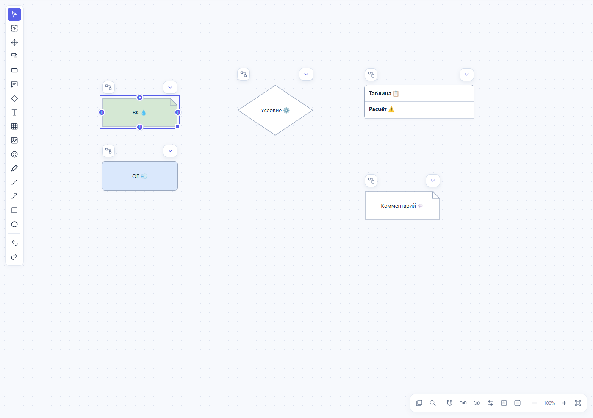

# Pipeline Studio 0.7.10 — значки, перенос и симметрия пары

Исторический отчёт 0.7.10. Постоянный размер значков на экране был ошибочной трактовкой требования. В [0.7.11](DIAGRAM-SCALE-2026-10-03.md) эмодзи и капсулы масштабируются вместе с блоками; остальные исправления сохранены.

Исправления выполнены после замечаний к 0.7.9. Исходный эталонный HTML сохранён; используется частная копия документа.

## Значки внутри блоков

В 0.7.9 проверки фиксированного размера касались капсул статусов и сворачивания. Значки 💧 и 💨 в тексте ВК/ОВ оставались изображениями в текстовом потоке и масштабировались с ним. В 0.7.10 для этих изображений вычисляется отдельное отображение фиксированного экранного размера, привязанное к исходному месту в тексте. Слот эмодзи продолжает участвовать в обычной раскладке: текст, переносы строк, авторазмер и данные документа не меняются при масштабировании.

Проверены реальные события колёсика при масштабах 25, 50, 100, 200 и 300 процентов. Размер каждого значка остаётся постоянным; его центр совпадает с исходным местом в тексте. Это работает в обычном блоке, условии, комментарии, заголовке таблицы и ячейке, в редакторе и просмотрщике. Печать использует исходные эмодзи без экранных дубликатов.

[Вид при 50%](images/zoom-and-drag/far.png) · [вид при 300%](images/zoom-and-drag/near.png). Снимки сделаны в программе на искусственном примере.

## Перенос

Повторные вычисления количества потомков внутри сортировки строили граф сотни раз за один расчёт вида. Теперь граф и размеры продолжений используются повторно в пределах одного расчёта; сортировка получает заранее вычисленные значения. План симметричного движения готовится один раз при начале жеста.

Во время перемещения сохраняются DOM-элементы всех блоков и обновляются их координаты. Расчёт адаптивной раскладки и трасс остаётся активным, поэтому цепочки раздвигаются уже во время движения. Полная перерисовка выполняется после завершения жеста.

На эталоне основной лист содержит 89 блоков. До изменения медиана отдельного расчёта вида составляла около 31 мс; после — около 2 мс. Браузерный замер включает полный обработчик движения и подтверждает сохранность всех DOM-узлов. В измеренном запуске его медиана — около 10 мс. Значения относятся к текущему компьютеру и указанной схеме.

## Область симметрии и пересечения

- Панель выбранных связей ищет настройку с точно таким же набором ID. Настройка пары не меняет существующую группу из четырёх связей при редактировании полей перед применением.
- При применении к двум ветвям более широкий пересекающийся набор отключается с сохранением его текущей геометрии; создаётся настройка только этих двух связей. Остальные ветви сохраняют видимые позиции. Общая гребёнка сохраняется как соединение, её широкая симметрия отключается при выделении части ветвей.
- Расчёт новой симметрии сначала учитывает действующие симметричные выходы условий. При запрещённых пересечениях расстояние включает их продолжения и соседние невыбранные ветви. Крайние ветви пары раздвигаются, сохраняя симметричность.
- Настройка «Разрешить пересечение ветвей» сохраняет прежнее назначение и допускает более плотное расположение.

## Комментарий и браузерное выделение

Комментарий имеет отдельный контур с загнутым углом. Преобразование сохраняет ID, текст, назначенный стиль и соединения; обратное преобразование убирает контур комментария, условие отображается ромбом.



Браузерное выделение текста отключено для холста, заголовков и панелей страницы. Нативное перетаскивание картинок тоже отключено. В текстовых полях и редактируемых ячейках сохраняется выделение, необходимое для замены текста; выделение объектов редактора продолжает работать.

## Проверки

Полный локальный прогон в Edge 154: **498 проверок прошли, одна пропущена**.

| Набор | Прошло |
|---|---:|
| Публичная модель | 169 |
| Дополнительная модель частного эталона | 8 |
| Публичные браузерные сценарии | 276 |
| Дополнительные браузерные сценарии частного эталона | 9 |
| HTTP | 25 |
| Материалы | 11 |

Новые наборы: шесть проверок модели для вложенной симметрии, области выбранной пары и подготовленного переноса; 29 браузерных сценариев для колёсика, размещения значков, печати, комментария, выделения, симметрии пары и движения эталона. Все прежние сценарии обратимых режимов, общих цепочек, материалов и сохранения прошли. Ошибок JavaScript в сценариях не обнаружено.

```sh
python tests/run_checks.py --browser --materials
```

Без частного эталона выполняется 481 публичная проверка. Необязательная конвертация офисного файла через LibreOffice пропущена, потому что программа не установлена. Частный документ, его материалы и снимки пользователя не входят в публичный комплект. Публичный релиз 0.7.10 не создавался.

Во время подготовки выдачи исходный документ обновился с редакции 546 до 625. Полный прогон выше использовал сохранённую редакцию 546; отдельная копия с движком 0.7.10 создана из редакции 625. Для неё дополнительно проверены открытие без ошибок JavaScript, точное совпадение всего встроенного JSON и всех 127 исходных координат на двух листах. Ещё восемь проверок переноса и обратимости раскладки на редакции 625 прошли отдельно от полного прогона.
